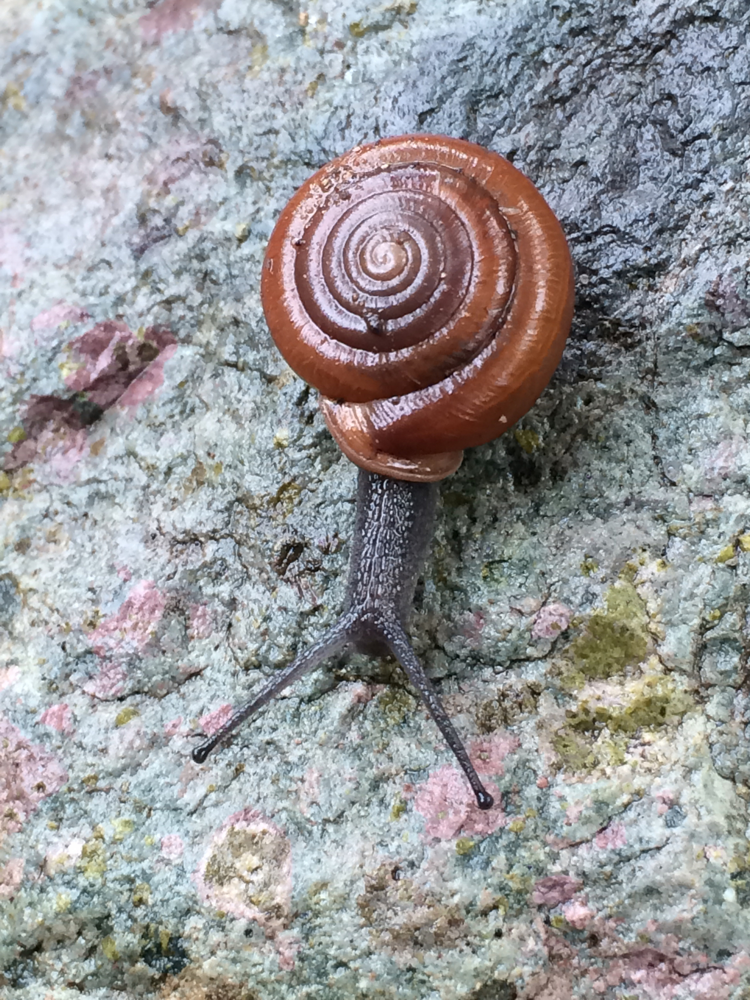

# Repository for Making Species Occurrence and Distribution maps for the Huachuca Woodland Snail (*Ashmunella levettei*)

## Zoe Evans, Josie Graydon, Hailey Park, and Bailie Wynbelt

## 🐌 Overview
insert description about species

## 📦 Dependencies
The project uses the following additional R packages (will be installed with file when needed):
+ dismo
+ maps
+ maptools
+ readr
+ rJava
+ spocc
+ tidyverse

## 📁 Structure

### data
+ `snaildata.csv`: data harvested from [GBIF](https://www.gbif.org/) and [iNaturalist](https://www.inaturalist.org) for _Ashmunella levettei_. 

### homework
+ organization of each of our homeworks
+ HW 3: group testing out collaborating on Posit, using Command-Push-Pull to write each of our names and favorite species within an R Markdown file.
+ HW 4: creating occurrence maps for _A. levettei_.
+ HW 6: creating current and future SDMs for _A. levettei_.

### output
+ maxent_outputs
 + `maxent.log`
+ `cleansnail.csv`: a cleaned up version of `snaildata.csv`
+ currentsnailSDM.jpg: a picture of the current _A. levettei_ SDM map we generated
+ futureSnailSDM.jpg: a picture of the future _A. levettei_ SDM map we generated for 70 years from now
+ occurrencemap.jpg: a picture of the occurrence map for _A. levettei_ that we generated

### photos
+ huachuca.jpeg: the _A. levettei_ image featured in the README file

### scripts
+ `dataacquisitioncleaning.R`: code for obtaining the GBIF data for _A. levettei_
+ `occurrencemap.R`: to create the occurrence map of the GBIF data for _A. levettei_

## Running the code
Run the sceripts in the following order:
1. `dataacquisitioncleaning.R`
2. `occurrencemap.R`
3. insert name of current SDM script
4. insert name of future SDM script